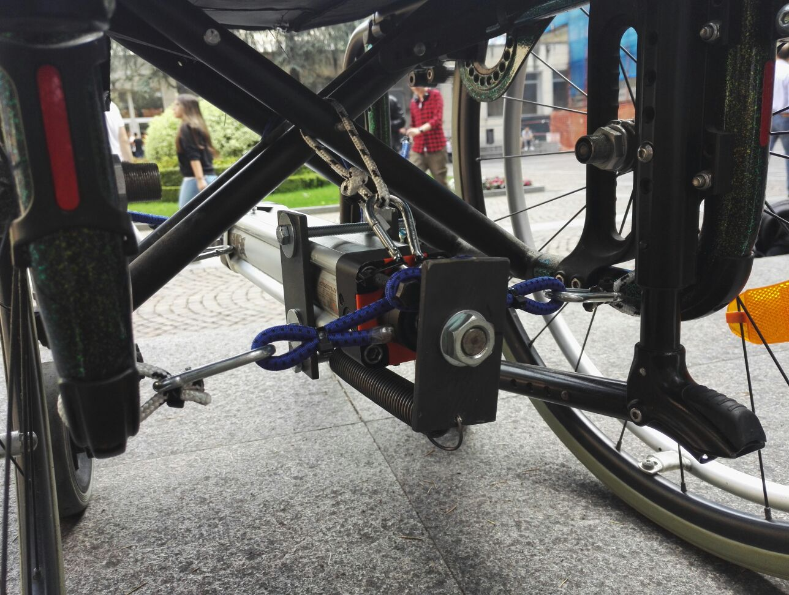
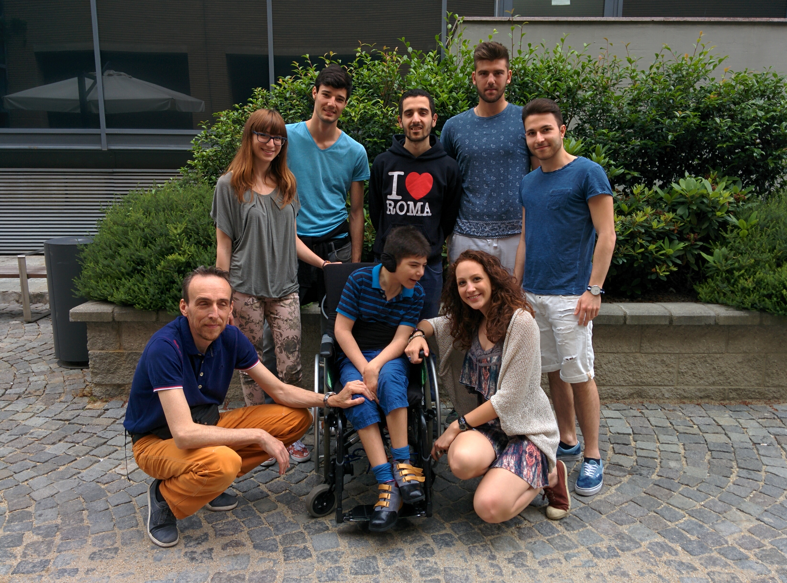

#\#E-motion

Emanuele è un ragazzo di 14 anni affetto dalla Sindrome di Lesch-Nyhan che gli causa movimenti involontari del tronco e della testa. Per controllare e attenuare tali movimenti il Team di Hackability ha progettato uno schienale ammortizzato in modo che esso potesse assorbire e gestire la forza da lui impressa e restituirla in modo graduale. Inoltre il Team ha affrontato il tema di fornire Emanuele con una bottiglietta d'acqua che lo facilitasse, in particolare impedendo all'acqua di fluire qualora il ragazzo avesse involontariamente fatto cadere la bottiglietta.

E' stato creato un prototipo per la modifica della carrozzina di Emanuele, ragazzo affetto da una  malattia genetica che provoca movimenti coreici incontrollati soprattutto a livello del tronco; per assorbire la forza impressa dalla spinta di Emanuele e restituirla gradualmente è stato progettato un sistema basato sull'utilizzo di un cuscino ad aria (noi abbiamo utilizzato un cuscino antidecubito a bolle d’aria) posto sullo schienale della carrozzina, collegato ad un cilindro a semplice effetto (è stato da noi adoperato un cilindro a doppio effetto con l’aggiunta di una molla esterna): il funzionamento del meccanismo è tale da permettere all'aria, una volta compresso il volume del cuscino tramite la spinta di Emanuele, di defluire dal cuscino al cilindro. 
Ciò fa espandere lo stelo il quale, grazie alla molla, torna in posizione gradualmente, restituendo così l’aria al cuscino e la stazione eretta ad Emanuele.

#Team

Hanno partecipato al progetto:

 - Gaia Marchetti: introduzione al progetto e spiegazione Sindrome di Lesch-Nyhan;
 - Armando Supino: presentazione richieste dei genitori per migliorare la quotidianità di Emanuele e spiegazione delle proposte per la risoluzione del problema della bottiglia;
 - Jacopo Milone: presentazione dei progetti per la modifica della carrozzina, introduzione del meccanismo di funzionamento dei progetti scartati;
 - Gianmarco Brusca: spiegazione del funzionamento del meccanismo attuato per la modifica della carrozzina;
 - Marco Nobile: esposizione e spiegazione dei materiali utilizzati per quanto riguarda la proposta messa in pratica e dei materiali che verranno utilizzati per quanto riguarda la proposta futura;
 - Sara Perfumo: esposizione degli strumenti utilizzati e riflessioni conclusive.

Tutti gli aspetti della fase di progettazione e prototipazione sono stati curati insieme dai componenti del gruppo, con maggiore attenzione agli aspetti meccanici da parte di Gianmarco Brusca, agli aspetti organizzativi da parte di Gaia Marchetti.
